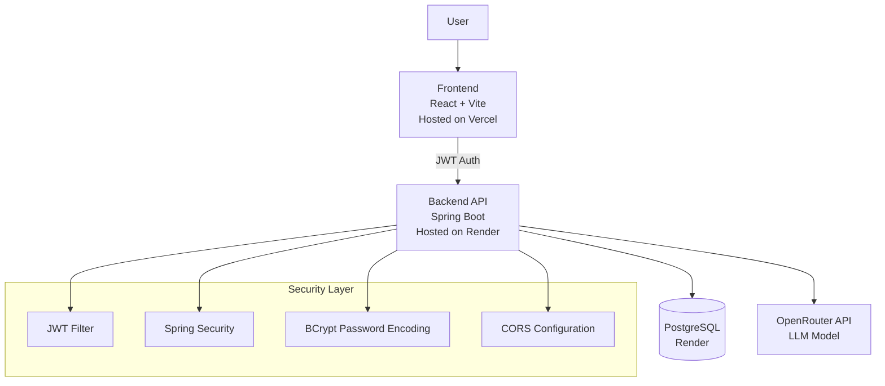

# 🚀 ToneShift Backend

ToneShift Backend is a production-ready Spring Boot API that powers AI-driven email tone rewriting with secure JWT authentication and PostgreSQL integration.

---

## 🌐 Live API

Backend URL:  
https://toneshift-backend.onrender.com

---

## 🏗 System Architecture



---

## 🛠 Tech Stack

- Java 17
- Spring Boot 3.2
- Spring Security (JWT)
- Spring Data JPA (Hibernate)
- PostgreSQL
- BCrypt Password Encoding
- OpenRouter API (GPT model)
- Render Deployment

---

## 🔐 Authentication Flow

1. User registers (`/auth/register`)
2. Password is hashed using BCrypt
3. User logs in (`/auth/login`)
4. Backend generates JWT
5. JWT is required for protected endpoints

---

## 📌 API Endpoints

### Public
- `POST /auth/register`
- `POST /auth/login`

### Protected
- `POST /ai/rewrite`

---

## 🗄 Database Tables

- users
- ai_analysis
- email

---

## ⚙️ Local Setup

### 1. Clone Repository
```bash
git clone https://github.com/your-username/toneshift-backend.git
cd toneshift-backend
```

### 2. Configure application.properties
```properties
spring.datasource.url=jdbc:postgresql://localhost:5432/your_db
spring.datasource.username=your_user
spring.datasource.password=your_password
```

### 3. Run Application
```bash
mvn clean spring-boot:run
```

---

## 🚀 Deployment

Backend is deployed on Render as a Web Service.

Environment Variables used:

- DATABASE_URL
- OPENROUTER_API_KEY
- JWT_SECRET

---

## 👨‍💻 Author

Harsh Sharma  
Java Backend Developer | Spring Boot | Cloud Deployment

---

## ⭐ Highlights

- Production-level JWT authentication
- Secure stateless backend
- Cloud-hosted PostgreSQL
- Real-world CORS handling
- Deployed full-stack architecture